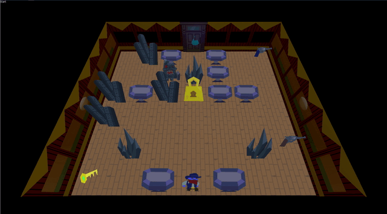

# Crazy Train
Crazy train is a 2-week godot mvp from August 2020. It is a turn-based tiled
puzzle game with the unique mechanic being that guns expload. After making it
we realized that the mechanics weren't as fun as we thought they would be.

George Antash did the art.

Note: Assets had to be reimported for screencapture do to an update in godot.
Some assets are actually higher quality.

Some cool facts:
* Windows are actually 1000 units offscreen. Cameras are flying around watching
another set offscreen and reporting to a series of meshes with viewport textures.
* Game is in phases, but only player and environmental phases are used in the
demo.
* Levels were going to connect to each other on the train, which is why there is
a door in the back.
